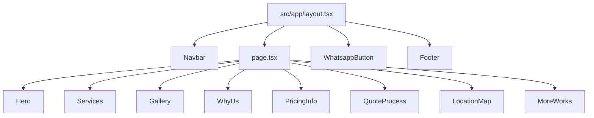

# TuPintor WWW

Sitio web de TuPintor construido con Next.js (App Router) y React.

## Stack

- **Runtime:** Node.js `v22.21.0` (`.nvmrc`)
- **Framework:** Next.js `15.5.9` (App Router, `src/app`)
- **Lenguaje:** TypeScript + React `19`
- **Estilos:** Tailwind CSS `4` + CSS global (`src/app/globals.css`)
- **Estado de datos cliente:** TanStack React Query
- **Testing:** Jest (`jest.config.ts`, entorno `jsdom`)
- **Linting:** ESLint flat config (`eslint.config.js`)
- **Deploy:** Vercel (`vercel.json`) y build standalone para contenedor (`next.config.ts`)

## Entry points

- `src/app/layout.tsx`: layout raíz global (fuentes, navbar, footer, QueryContainer)
- `src/app/page.tsx`: página principal `/`

Actualmente no hay rutas API (`src/app/**/route.*`) en el repositorio.

## Entornos

| Entorno | Uso | Comando |
|---|---|---|
| Local desarrollo | Ejecutar app con recarga | `pnpm dev` |
| Local producción | Build y ejecución local | `pnpm build` + `pnpm start` |
| Vercel | Deploy de Next.js | detección automática por `framework: nextjs` |
| Contenedor/PM2 | Ejecutar build standalone | `pm2-runtime` con `ecosystem.config.cjs` |

No se detectaron variables de entorno consumidas en `src/` (`process.env` / `NEXT_PUBLIC_*`).

## Setup local

1. Instalar Node.js `v22.21.0`.
2. Instalar dependencias: `pnpm install`
3. Levantar desarrollo: `pnpm dev`
4. Abrir `http://localhost:3000`

## Scripts disponibles

| Script | Descripción |
|---|---|
| `pnpm dev` | Inicia Next.js en modo desarrollo (Turbopack) |
| `pnpm build` | Genera build de producción |
| `pnpm start` | Sirve build de producción |
| `pnpm lint` | Ejecuta lint |
| `pnpm test` | Ejecuta tests con Jest |
| `pnpm nuke:dependencies` | Ejecuta `npkill` para limpieza de dependencias |

## Estructura del proyecto

```text
tupintor-www/
├─ public/
│  └─ images/
├─ src/
│  ├─ app/
│  │  ├─ components/
│  │  │  ├─ common/
│  │  │  └─ *.tsx
│  │  ├─ globals.css
│  │  ├─ layout.tsx
│  │  └─ page.tsx
│  ├─ backend/   (estructura creada, sin archivos)
│  ├─ lib/       (vacío)
│  └─ tests/     (vacío)
├─ next.config.ts
├─ vercel.json
├─ jest.config.ts
├─ eslint.config.js
└─ Dockerfile
```

## Grafo de componentes (home)



